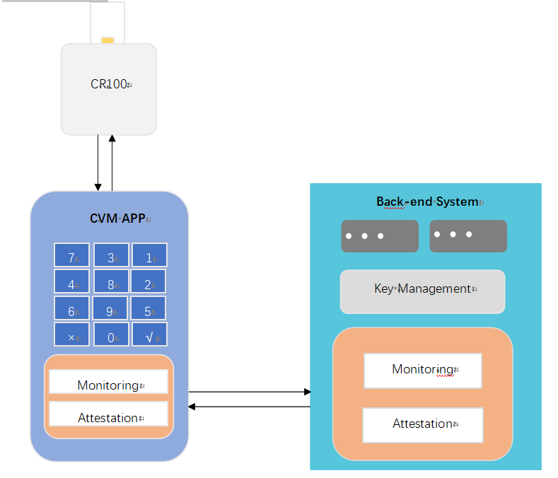
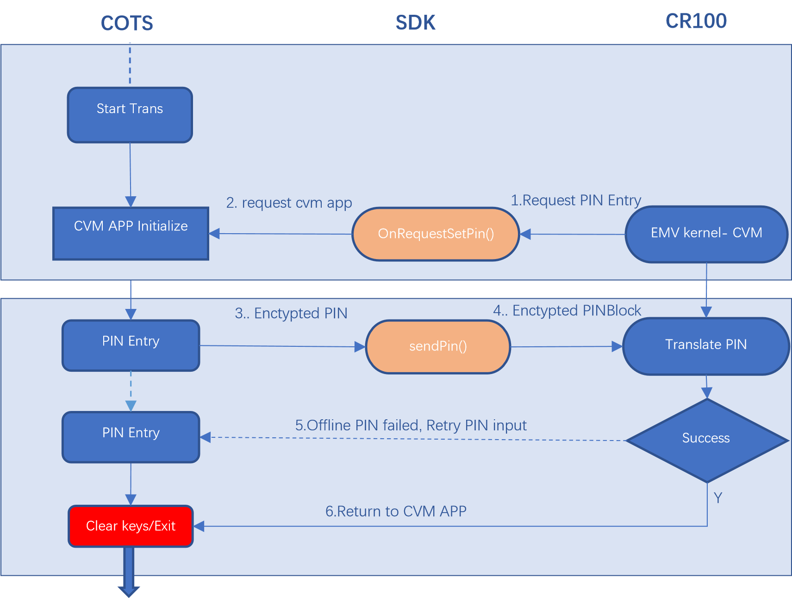

# CVM PIN

**Dspread PIN CVM APP**

**Software-based PIN Entry on COTS**

Version 1.0.2

Jue 2020

## Introduction

Dspread has a long history of being the leader in mPOS solutions. We also have a Universal SDK that can be used for all DSPREAD products making integration easy. CR100 is a superior product with exceptional performance, flexibility and reliability for payment businesses. With CR100, you can accept payments wherever you go

CR100 is secure card reader with contact and contactless EMV capability, which includes all certified payment kernel \(EMV contact L1 & L2, VISA payWave, MasterCard PayPass, AMEX ExpressPay, Discovey ZIP, China Union qPBOC, Mifare etc.\). It is certified with PCI PTS v5.X PIN reader\(SCRP\) hardware that enforce security PIN entry on any COTS device. And CR100 is using our Universal SDK that provide one set generic PIN CMV APP API that ensure security of PIN convey between COTS and CR100.Based on CR100 PIN CVM APP API, client can easily develop their own PIN CVM APP and integrate to their own Monitoring/Attestation system.

## Spoc solution Overview

 The follow diagram illustrates the flow of pin transaction in a software based PIN entry solution. Steps 1-7 are detailed on the following page.

 

## DSPREAD PIN CVM APP API

 DSPREAD PIN CVM APP API enforce the security between COTS and CR100. Bellow is the comparison implementation PIN entry for online pin and offline pin scenario. Both will call below API

* **OnRequestSetPin\(\)**
* **sendPin\(pinBlock\)**

After cardholder present the card to CR100, the EMV kernel will determine if PIN entry needed. Then CR100 will initial PIN entry request to CVM APP by calling SDK delegate: OnRequestSetPin\(\). Mobile CVM APP need draw PIN entry layout in this callback. Random Scattered digits layout keyboard with “\*\*\*\*” mask can enforce PIN input security.

**Pin On Mobile Steps**

* 1. PIN CVM Application and SCRP are initialized with their financial keys \(this may be asynchronous with the transaction\).
  2. A secure communication channel between the PIN CVM Application and the back-end monitoring system is established.
  3. The back-end monitoring system determines the security status of the mobile payment-acceptance platform \(SCRP, COTS platform and PIN CVM Application\) using the attestation component.
  4. An EMV card, contact or contactless, or an NFC-enabled mobile EMV payment device is presented to the CR100.
  5. CR100 EMV kernel determine if PIN required for current transaction by check card CVM list. And send PIN Entry request to CVM APP
  6. The PIN CVM APP PIN entry component renders a PIN entry screen on the COTS platform and the cardholder enters their PIN using the rendered PIN pad from the PIN CVM Application. The resulting information is enciphered and sent to the SCRP by the PIN CVM Application.
  7. The SRED component of the SCRP enciphers the account data using preloaded data-encryption keys according to either **Case 1** \(online PIN verification\) or **Case 2** \(offline PIN verification\) above. Offline will validated by ICC card. If PIN incorrect, CVM app will request to input PIN again. You can also retrieve remaining pin try limit by calling getCVMPinTryLimit\(\).
  8. The payment transaction is processed.

## SCRP Enablement Token API

**Token example**

0F2000000002000000000112A4537790020123

<table>
  <thead>
    <tr>
      <th style="text-align:left">0F</th>
      <th style="text-align:left">20000000020</th>
      <th style="text-align:left">0000000001</th>
      <th style="text-align:left">12A4537790</th>
      <th style="text-align:left">02</th>
      <th style="text-align:left">0123</th>
    </tr>
  </thead>
  <tbody>
    <tr>
      <td style="text-align:left">
        
Length of Token

        
Type: Fixed

      </td>
      <td style="text-align:left">Last 10 digits of SN</td>
      <td style="text-align:left">Token counter</td>
      <td style="text-align:left">Random</td>
      <td style="text-align:left">Length of token interval</td>
      <td style="text-align:left">Interval of token seconds</td>
    </tr>
  </tbody>
</table>

**Generate digital envelope from token**

1.RAS encrypt the 3DES KEY ,then we get section **\(2\) \[Public RAS Encryption \]** of the digital envelope

2.use the 3DES key encrypt the plain text ,then get section **\(3\)\[Encrypted Message\]** of the digital envelope

3.using SHA1 sigature \(2\) and \(3\) . then use sending private RAS key encrypt the 20 BYTE SHA1 result.then get **\(4\)\[Private RSA Key encryption\]** of the digital envelope

4.finally ,calculate the total length of digital envelope ,\(1\) the resulting digital envelope: len\(4B\) Public RAS Encryption\(128B\) 3DES Encrypt Private RAS Signature\(128B\) 1 2 3 4

the resulting digital envelope:

| Len\(4\) Bytes | Public RSA Encryption\(128B\) | 3DES Encrypt | Private RSA Signature\(128B\) |
| :--- | :--- | :--- | :--- |
| 1 | 2 | 3 | 4 |

**Enablement Token API**

pos.updateWorkKey\(String envelope\)

