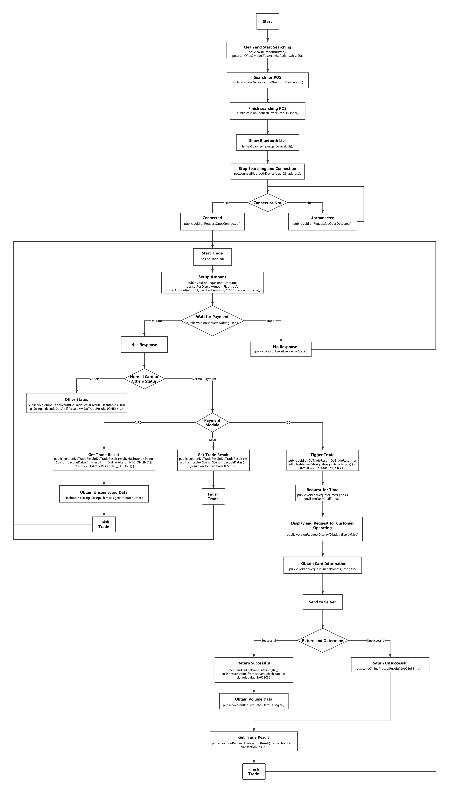

# SDK

请通过以下链接下载DemoAPP和SDK包；DemoAPP实现了基本的获取设备信息和交易等的功能，并可提供APP源代码方便参考开发；SDK涵盖了实现交易的内部各个接口。

Andorid DemoAPP\_v3.0.1\(4.57MB\)：[下载](http://d.7short.com/AndroidDemo) IOS DemoAPP\_v2.5.1\(1.28MB\)：[下载](http://d.7short.com/)

Android SDK:[前往](https://gitlab.com/dspread/android) IOS SDK:[前往](https://gitlab.com/dspread/ios)

【版本更新记录】 2021-01-12： v3.2.3增加了updateIPEKOperationByKeyType接口 2020-12-18 v3.2.2、v3.2.1给createInsecureRfcommSocketToServiceRecord添加注释以及修改getEncryptData接口添加了AES特征 2020-12-17 v.3.2.0修正有关cashback在1630中的指令bug

_注：_ _SDK支持Android 4.0及以上系统环境_

## 1.概述

SDK是面向安卓和IOS设备的开发包；此开发包包含了移动设备连接鼎合POS机以及进行相关交易涉及到的相关接口。本文档以安卓为主要方向，介绍了SDK的使用和在交易过程涉及到的接口的说明。

### 1.1.文档使用范围

该POS机SDK文档主要适用于开发人员内部的参考阅读。

### 1.2.功能清单

POS机SDK主要提供如下功能：

| 模块 | 功能 |
| :--- | :--- |
| 信息获取 | 包括获取POS的ID、信息和设备公钥等 |
| 设备更新 | 包括更新设备的各个交易密钥、休眠时间以及EMV配置和固件等 |
| 支持交易 | 支持刷卡、贴卡和插卡的三种交易的具体实现接口 |

## 2.环境信息

Android 4.0及以上

## 3.Java SDK使用说明

### 3.1. 初始化SDK

先通过不同的‘CommunicationMode’连接设备到POS，而具体的选择应当基于硬件配置；再使用open接口去初始化SDK。

初始化方法：

```java
private void open(CommunicationMode mode) {
        listener = new MyPosListener();
        pos = QPOSService.getInstance(mode);
        if (pos == null) {
            statusEditText.setText("CommunicationMode unknow");
            return;
        }
        pos.setConext(getApplicationContext());
        Handler handler = new Handler(Looper.myLooper());
        pos.initListener(handler, listener);
    }
```

CommunicationMode的类型：

```java
public static enum CommunicationMode{
        AUDIO,  //音频
        BLUETOOTH,  //蓝牙
        BLUETOOTH_BLE, //低功耗蓝牙
        UART,  // 串口
        USB  //USB
    }
```

### 3.2. 开始交易

App开始做交易通过调用下面的方法，其中参数是设定的超时值，其单位是秒

```java
 pos.doTrade(60);
```

### 3.3. 设置金额

在调用doTrade之后，会有一个回调函数来促使用户输入金额和交易类型等的数据，然后SDK通过使用pos.setAmount去设置金额等参数。具体实例如下参考

```java
@Override
        public void onRequestSetAmount() {
            pos.setAmount(amount, cashbackAmount, "156",
                                    TransactionType.GOODS);
        }
```

参数分别为交易金额、现金提取额、货币代码、交易类型，其中交易类型有以下内容：

```java
public static enum TransactionType {
        GOODS, // 货物 GOODS
        SERVICES, // 服务 service
        CASH, // 现金 cash
        CASHBACK, //  返现
        INQUIRY, // 查询
        TRANSFER, // 转账
        ADMIN, // 管理
        CASHDEPOSIT, // 存款
        PAYMENT, // 付款 支付
        PBOCLOG, // 0x0A /*PBOC日志(电子现金日志)*/
        SALE, // 0x0B /*消费*/
        PREAUTH, // 0x0C /*预授权*/
        ECQ_DESIGNATED_LOAD, // 0x10 /*电子现金Q指定账户圈存*/
        ECQ_UNDESIGNATED_LOAD, // 0x11 /*电子现金费非指定账户圈存*/
        ECQ_CASH_LOAD, // 0x12 /*电子现金费现金圈存*/
        ECQ_CASH_LOAD_VOID, // 0x13 /*电子现金圈存撤销*/
        ECQ_INQUIRE_LOG, // 0x0A /*电子现金日志(和PBOC日志一样)*/
        REFUND,//退款
        UPDATE_PIN,     //修改密码
        SALES_NEW,
        NON_LEGACY_MONEY_ADD, /* 0x17*/
        LEGACY_MONEY_ADD  /*0x16*/
    }
```

### 3.4.等待用户放置卡

设置完毕金额后，在此会有一个回调函数如下，提示用户去放置卡：贴卡、刷卡、插卡；

```java
@Override
        public void onRequestWaitingUser() {//wait user to insert/swipe/tap card
            dismissDialog();
            statusEditText.setText(getString(R.string.waiting_for_card));
        }
```

### 3.5.返回交易数据结果

用户放置完卡片之后，POS机去读卡，并根据卡交易类型不同返回不同的数据；其中刷卡（MCR）和贴卡（NFC）方式比较简单，会把交易结果直接返回给onDoTradeResult（）中，而插卡（ICC）方式会进行进一步EMV操作。

```java
    @Override
    public void onDoTradeResult(DoTradeResult result,
            Hashtable<String, String> decodeData) {
        if (result == DoTradeResult.NONE) {                
        } 
        else if (result == DoTradeResult.ICC) {
            statusEditText.setText(getString(R.string.icc_card_inserted));
            pos.doEmvApp(EmvOption.START);
        } 
        else if (result == DoTradeResult.NOT_ICC) {
            statusEditText.setText(getString(R.string.card_inserted));
        }
        else if (result == DoTradeResult.MCR) {
            String maskedPAN = decodeData.get("maskedPAN");
            String expiryDate = decodeData.get("expiryDate");
            String cardHolderName = decodeData.get("cardholderName");
            String ksn = decodeData.get("ksn");
            String serviceCode = decodeData.get("serviceCode");
            String track1Length = decodeData.get("track1Length");
            String track2Length = decodeData.get("track2Length");
            String track3Length = decodeData.get("track3Length");
            String encTracks = decodeData.get("encTracks");
            String encTrack1 = decodeData.get("encTrack1");
            String encTrack2 = decodeData.get("encTrack2");
            String encTrack3 = decodeData.get("encTrack3");
            String partialTrack = decodeData.get("partialTrack");
            String pinKsn = decodeData.get("pinKsn");
            String trackksn = decodeData.get("trackksn");
            String pinBlock = decodeData.get("pinBlock");
            String encPAN = decodeData.get("encPAN");
            String trackRandomNumber = decodeData
                    .get("trackRandomNumber");
            String pinRandomNumber = decodeData.get("pinRandomNumber");
                        + "\n";
        } else if ((result == DoTradeResult.NFC_ONLINE) || (result == DoTradeResult.NFC_OFFLINE)) {
            ...
        }
        else if (result == DoTradeResult.NO_RESPONSE) {
            statusEditText.setText(getString(R.string.card_no_response));
        } else if (result == DoTradeResult.NO_UPDATE_WORK_KEY) {
            statusEditText.setText("not update work key");
        }
    }
```

NFC除了以上的数据外，还会有一个接口获取NFC batch数据，并显示出来：

```java
Hashtable<String, String> h = pos.getNFCBatchData();
String tlv = h.get("tlv");
```

### 3.6. 发起emv交易

在上一步的onDoTradeResult\(\)中，若是检测到ICC交易方式，会调用pos.doEmvApp\(\)进行emv交易，实例如下：

```java
pos.doEmvApp(EmvOption.START);
```

其中EmvOption枚举类如下：

```java
public static enum EmvOption {
    /**
     * emv ICC start do trade
     */
    START,
    /**
     * start with force online trade
     */
    START_WITH_FORCE_ONLINE,
    /**
     * start with force PIN(online/offline pin)
     */
    START_WITH_FORCE_PIN,
    /**
     * start with force online trade and force PIN(online/offline)
     */
    START_WITH_FORCE_ONLINE_FORCE_PIN
}
```

然后设备的emv内核会促使SDK调用几个回调方法获取emv交易所需要的信息以及显示相关提示内容给客户

#### 3.6.1. 发送交易时间

emv交易需要获取交易时间，从以下接口获取

```java
 @Override        
 public void onRequestTime() {            
     String terminalTime = new SimpleDateFormat("yyyyMMddHHmmss")                                   
            .format(Calendar.getInstance().getTime());            
     pos.sendTime(terminalTime);        
 }
```

#### 3.6.2. 显示提示信息

SDK在这里提示用户去进行操作信息。

```text
@Override
public void onRequestDisplay(Display displayMsg)
```

其中，Display的枚举类有如下：

```text
public static enum Display {
    TRY_ANOTHER_INTERFACE, 
    PLEASE_WAIT,
    REMOVE_CARD, 
    CLEAR_DISPLAY_MSG, 
    PROCESSING, 
    PIN_OK, 
    TRANSACTION_TERMINATED, 
    INPUT_PIN_ING, 
    MAG_TO_ICC_TRADE, 
    INPUT_OFFLINE_PIN_ONLY, 
    CARD_REMOVED, 
    INPUT_LAST_OFFLINE_PIN,
    MSR_DATA_READY
}
```

#### 3.6.3. 获取交易信息

在这里用户可以获取交易的tlv数据，SDK在这里决定发送给服务器的数据。

```java
@Override        

public void onRequestOnlineProcess(String tlv) {
    TRACE.d("onRequestOnlineProcess = " + tlv);

    //sending online message tlv data to backend server             
    response=sendTlvToServer()            
     ....             

    //send the received online processing result to POS             

    //response should contain tag 8A (authorise responce code) and tag 91 (ARPC)             

    pos.sendOnlineProcessResult(response);        

}
```

#### 3.6.4. 获取批处理数据

交易完成时,批处理数据将通过以下回调返回给应用程序

```java
@Override
public void onRequestBatchData(String tlv) {
}
```

#### 3.6.5. 返回交易结果

交易结果的信息通过以下方式返回给应用程序：

```text
@Override
public void onRequestTransactionResult(TransactionResult transactionResult) {
    if (transactionResult == TransactionResult.APPROVED) {
    } else if (transactionResult == TransactionResult.TERMINATED) {
    } else if (transactionResult == TransactionResult.DECLINED) {
    } else if (transactionResult == TransactionResult.CANCEL) {
    } else if (transactionResult == TransactionResult.CAPK_FAIL) {
    } else if (transactionResult == TransactionResult.NOT_ICC) {
    } else if (transactionResult == TransactionResult.SELECT_APP_FAIL) {
    } else if (transactionResult == TransactionResult.DEVICE_ERROR) {
    } else if (transactionResult == TransactionResult.CARD_NOT_SUPPORTED) {
    } else if (transactionResult == TransactionResult.MISSING_MANDATORY_DATA) {
    } else if (transactionResult == TransactionResult.CARD_BLOCKED_OR_NO_EMV_APPS) {
    } else if (transactionResult == TransactionResult.INVALID_ICC_DATA) {
    }     
}
```

## 4.流程图



